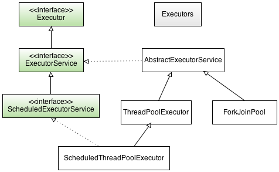

# C++

# java

## [Executor](https://docs.oracle.com/en/java/javase/11/docs/api/java.base/java/util/concurrent/Executor.html) framework

Executor is based on the producer-consumer pattern, where activities that submit tasks are the producers 
(producing units of work to be done) and the threads that execute tasks are the consumers 
(consuming those units of work).

### Executor implements

* ExecutorService
  * [AbstractExecutorService](https://docs.oracle.com/en/java/javase/11/docs/api/java.base/java/util/concurrent/AbstractExecutorService.html)
  * [ThreadPoolExecutor](https://docs.oracle.com/en/java/javase/11/docs/api/java.base/java/util/concurrent/ThreadPoolExecutor.html)
  * [ForkJoinPool](https://docs.oracle.com/en/java/javase/11/docs/api/java.base/java/util/concurrent/ForkJoinPool.html)
* ScheduledExecutorService
  * [ScheduledThreadPoolExecutor](https://docs.oracle.com/en/java/javase/11/docs/api/java.base/java/util/concurrent/ScheduledThreadPoolExecutor.html) 

### Executor Factory
Class [Executors](https://docs.oracle.com/en/java/javase/11/docs/api/java.base/java/util/concurrent/Executors.html) 
provides methods that create and return
* ExecutorService
* ScheduledExecutorService
* ThreadFactory

# Reference
[java-executor-framework](https://myshadesofgray.wordpress.com/2014/04/13/java-executor-framework/)

# Python

## Executor Framework

* [Executor](https://docs.python.org/3.11/library/concurrent.futures.html#concurrent.futures.Executor)
  * ThreadPoolExecutor
  * ProcessPoolExecutor

